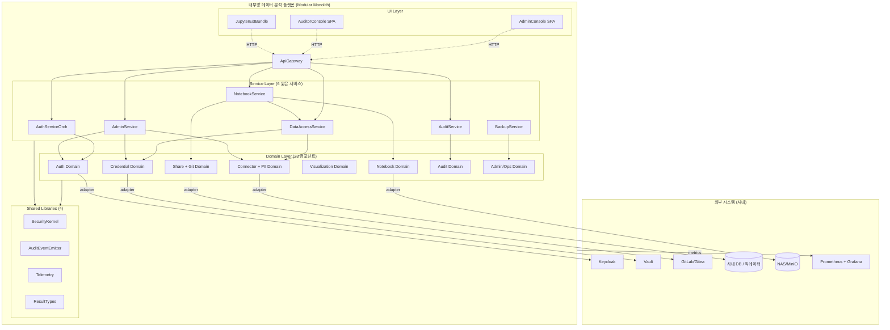

# Application Design — 내부망 데이터 분석 플랫폼 (마스터 문서)

**작성일**: 2026-05-21
**버전**: 1.0 (Inception)
**프로젝트 유형**: Greenfield
**기반 입력**: `requirements.md`, `stories.md`, `personas.md`, `execution-plan.md`, `application-design-plan.md`

> 본 문서는 [`components.md`](./components.md), [`component-methods.md`](./component-methods.md), [`services.md`](./services.md), [`component-dependency.md`](./component-dependency.md)의 통합 마스터입니다. 상세는 각 문서를 참조하세요.

---

## 1. 설계 결정 요약 (Design Decisions)

`application-design-plan.md`의 15개 [Answer]를 통해 다음 결정사항 확정:

| ID | 결정 | 영향 |
|---|---|---|
| Q-AD-1=B | **중간 입자** (도메인당 2~4 컴포넌트) | 23개 도메인 컴포넌트 + 4 공유 라이브러리 + UI 3개 |
| Q-AD-2=A | **공유 라이브러리**로 Auth/Audit/Telemetry | `SecurityKernel`, `AuditEventEmitter`, `Telemetry`, `ResultTypes` |
| Q-AD-3=A | **JupyterLab Ext + 분리 Admin/Audit SPA** | UI 3종(JupyterExtBundle + AdminConsole + AuditorConsole) |
| Q-AD-4=A | **언어 중립 의사 시그니처** | 본 단계 표기 — 구현 언어 결정은 NFR Requirements |
| Q-AD-5=A | **Result/Either 통일** | 모든 메서드가 `Result<T, E>` 반환. 시스템 panic만 예외 throw |
| Q-AD-6=A | **얇은 서비스 + 도메인 컴포넌트가 일을 함** | 6개 서비스 모두 트랜잭션·감사 위주, 도메인 로직은 컴포넌트에 |
| Q-AD-7=A | **도메인 단위 서비스** | AuthOrchestrator / DataAccess / Notebook / Admin / Audit / Backup |
| Q-AD-8=A | **동기 기본**, 명시적 비동기만 큐 | outbox(감사·Git push·LLM·백그라운드 잡)만 비동기 |
| Q-AD-9=A | **Redis Streams 또는 RabbitMQ** | 큐 백엔드 가정 (확정은 NFR Design) |
| Q-AD-10=A | **모든 외부 시스템에 어댑터** | KeycloakAdp / VaultAdp / GitAdp / JupyterHubSpawner / RDBMS·BigData Connectors |
| Q-AD-11=A | **Modular Monolith** → Phase 2 마이크로서비스 추출 | Docker Compose MVP, 도메인 모듈 내부 분리 |
| Q-AD-12=A | **Anemic Model + Service** (단, PII/권한은 Rich 부분 적용) | DTO + 서비스 로직 |
| Q-AD-13=A | **Defense in Depth** (Gateway + 모든 컴포넌트 진입) | `SecurityKernel` 의무 호출 |
| Q-AD-14=A | **메타 DB 강일관성 + outbox 비동기** | Git push, 감사, LLM은 eventual consistency |
| Q-AD-15=A | **PII 렌더 직전 + 사전 컬럼 메타 차단** | 이중 적용 — `PiiMaskingFilter` |

---

## 2. 시스템 개관

---

## 3. 컴포넌트 카탈로그 (요약)

상세는 `components.md` 참조.

- **Gateway**: ApiGateway, OidcCallbackHandler
- **Auth**: AuthService, SessionStore, RoleResolver, KeycloakAdapter
- **Credential**: CredentialVault, VaultAdapter
- **Connector**: ConnectionRegistry, ConnectorFactory, RdbmsConnector, BigDataSqlConnector, QueryExecutor, SchemaIntrospector
- **PII**: PiiPolicyStore, PiiMaskingFilter
- **Notebook**: NotebookStore, JupyterHubSpawner, KernelManager, FileUploadHandler
- **Visualization**: ChartBuilder
- **Share**: ShareLinkManager
- **Git**: GitAdapter, AutoCommitOrchestrator
- **UI**: AdminConsole, AuditorConsole, JupyterExtensionsBundle
- **Ops**: BackupScheduler, RestoreVerifier
- **Audit**: AuditWriter, AuditQueryApi
- **공유 라이브러리**: SecurityKernel, AuditEventEmitter, Telemetry, ResultTypes

**합계**: 23 도메인 컴포넌트 + 3 UI + 4 공유 라이브러리 = **30개 모듈** (MVP)

Phase 2 후보: LlmProxyAdapter, LlmGovernor, ReportRenderer, ReportScheduler, ColumnLevelGuard, NotebookSearchIndexer (6개)

---

## 4. 서비스 카탈로그 (요약)

상세는 `services.md` 참조.

| 서비스 | 도메인 | 주요 흐름 |
|---|---|---|
| **AuthServiceOrchestrator** | Auth | 로그인 / 역할 변경 (활성 Admin ≥ 1 invariant 트랜잭션) |
| **DataAccessService** | Connector+PII | SQL 실행 (인가 → 자격증명 → 연결 → 쿼리 → 마스킹 → 감사) |
| **NotebookService** | Notebook+Share+Git | 노트북 저장 + outbox Git 커밋, 공유 노트북 실행 격리 |
| **AdminService** | Admin | 콘솔 백엔드 (사용자/커넥션/PII) |
| **AuditService** | Audit | 감사 발행 consumer + 검색·내보내기 |
| **BackupService** | Ops | 일 1회 백업 + 월 1회 복구 리허설 |

각 서비스는:
- `SecurityKernel.authorize(...)` 진입 직후 호출 (Defense in Depth)
- 모든 분기에서 `AuditEventEmitter.emit(...)`
- `Result<T, DomainError>` 반환, 시스템 오류는 전역 핸들러

---

## 5. 컴포넌트 의존성·통신 (요약)

상세는 `component-dependency.md` 참조.

- **acyclic 검증 완료**
- **동기 기본**(in-process 함수 또는 HTTP) + 외부 시스템 호출은 가능한 비동기/timeout + 재시도
- **비동기 경로 4종**: 감사 outbox, Git push outbox, 5s+ 백그라운드 잡, (Phase 2) LLM 호출
- **외부 시스템 결합**: 8개 외부 시스템 각각에 어댑터 컴포넌트

---

## 6. 스토리 ↔ 컴포넌트 매핑 검증

| Story | 주요 관여 컴포넌트 |
|---|---|
| US-AUTH-01 (SSO) | ApiGateway, OidcCallbackHandler, KeycloakAdapter, SessionStore, AuthServiceOrchestrator |
| US-AUTH-02 (역할 변경) | RoleResolver, AuthService, AuditEventEmitter |
| US-AUTH-03 (세션 만료) | SessionStore, NotebookStore (자동 저장 보존) |
| US-AUTH-04 (Admin MFA) | KeycloakAdapter (Keycloak 정책 위임) |
| US-AUTH-05 (비밀번호 정책) | KeycloakAdapter |
| US-DS-01~03 (커넥션 등록·권한) | ConnectionRegistry, CredentialVault, VaultAdapter, AdminService |
| US-DS-04 (개인 자격증명) | CredentialVault, VaultAdapter |
| US-DS-05 (스키마 사이드 패널) | SchemaIntrospector, JupyterExtBundle |
| US-DS-06 (파일 업로드) | FileUploadHandler |
| US-DS-07 (공유 스토리지) | FileUploadHandler |
| US-NB-01 (JupyterHub 진입) | JupyterHubSpawner |
| US-NB-02 (SQL 실행) | KernelManager, DataAccessService 전체 흐름 |
| US-NB-03 (Py/R 실행) | KernelManager |
| US-NB-04 (SQL 자동완성) | SchemaIntrospector, JupyterExtBundle |
| US-NB-05 (자동 저장) | NotebookStore |
| US-NB-06 (백그라운드 셀) | KernelManager (job queue) |
| US-VIS-01~04 (시각화) | ChartBuilder, JupyterExtBundle |
| US-SHARE-01 (Git 자동 커밋) | NotebookStore (outbox) → AutoCommitOrchestrator → GitAdapter |
| US-SHARE-02 (워크스페이스 분리) | NotebookStore |
| US-SHARE-03 (링크 공유) | ShareLinkManager |
| US-SHARE-04 (공유 실행) | NotebookService.executeShared, DataAccessService (현재 사용자 ctx) |
| US-SEC-01 (감사 전수) | AuditEventEmitter → AuditService → AuditWriter |
| US-SEC-02 (PII 마스킹) | PiiPolicyStore, PiiMaskingFilter |
| US-SEC-03 (감사 검색) | AuditQueryApi, AuditService, AuditorConsole |
| US-SEC-04 (보안 헤더) | ApiGateway, SecurityKernel |
| US-SEC-05 (TLS + at-rest) | ApiGateway + VaultAdapter (인프라 레벨 강제) |
| US-ADM-01 (사용자 관리) | RoleResolver, AdminConsole, AdminService |
| US-ADM-02 (커넥션 관리) | ConnectionRegistry, AdminService |
| US-ADM-03 (PII 패턴) | PiiPolicyStore, AdminService |
| US-ADM-04 (헬스 대시보드) | Telemetry (Prometheus exporter) |
| US-ADM-05 (백업·복구) | BackupScheduler, RestoreVerifier, BackupService |

**MVP 40개 스토리 모두 ≥ 1 컴포넌트에 매핑** ✓

---

## 7. 보안 베이스라인 적용 위치 (Step D6 검증)

| Security Rule | 적용 컴포넌트/서비스 |
|---|---|
| SECURITY-01 (at-rest + TLS) | ApiGateway, CredentialVault → VaultAdapter, BackupScheduler |
| SECURITY-02 (액세스 로깅) | ApiGateway + Telemetry |
| SECURITY-03 (구조화 로깅) | Telemetry SL-3 |
| SECURITY-04 (HTTP 헤더) | ApiGateway |
| SECURITY-05 (입력 검증 + 파라미터화) | QueryExecutor (ParamQuery 강제), AdminService(validateRegex) |
| SECURITY-06 (최소 권한) | RoleResolver, ConnectionRegistry.list (RBAC 필터) |
| SECURITY-07 (deny-by-default) | ApiGateway + LlmProxyAdapter(Phase 2) |
| SECURITY-08 (앱 인가) | SecurityKernel.authorize + 컴포넌트 별 |
| SECURITY-09 (하드닝) | OidcCallbackHandler(일반화 에러), 전역 예외 핸들러 |
| SECURITY-10 (의존성/SBOM) | 빌드 인프라 — Code Generation/Build 단계 |
| SECURITY-11 (모듈화 + Rate Limit) | ApiGateway |
| SECURITY-12 (인증 정책) | KeycloakAdapter + AuthService |
| SECURITY-13 (무결성) | VaultAdapter(역직렬화 안전성), 빌드 단계 |
| SECURITY-14 (보안 알림 + append-only + 90↑일) | AuditWriter, BackupService 알림 |
| SECURITY-15 (fail-closed) | 모든 서비스의 전역 예외 핸들러, SecurityKernel |

---

## 8. PBT 적용 위치 (Step D6 검증)

| PBT 기법 | 적용 컴포넌트 |
|---|---|
| **Idempotent** | ConnectionRegistry.register, CredentialVault.register, AutoCommitOrchestrator, PiiMaskingFilter.mask, AuthService.changeRole |
| **State-Machine** | SessionStore (issue→validate→invalidate), CredentialVault (등록→회전→삭제), KernelManager (jobs) |
| **Invariant** | RoleResolver (활성 Admin ≥ 1), ShareLinkManager (권한 < 요구권한 → 거절), ConnectionRegistry (권한 없는 사용자는 어떤 객체도 못 봄) |
| **Oracle** | PiiMaskingFilter (마스킹 함수 vs 레퍼런스 정규식) |
| **Round-trip** | FileUploadHandler (CSV/Parquet upload-read-serialize) |
| **Domain-Generator** | PiiPolicyStore (정규식 + 후보 문자열 생성기), AuthService (비밀번호 정책) |

`stories.md` G7의 13개 PBT 스토리가 모두 컴포넌트에 매핑됨.

---

## 9. 횡단 관심사 적용 검증 (Step D6)

- **인증** (SecurityKernel.authenticate): ApiGateway + 모든 서비스 진입점 ✓
- **인가** (SecurityKernel.authorize): 모든 서비스 진입점 + RoleResolver의 도메인 검증 ✓ (이중)
- **감사** (AuditEventEmitter): 모든 도메인 컴포넌트가 상태 변경 시 발행 ✓
- **관측성** (Telemetry): 모든 서비스가 span/metric/log ✓
- **에러 통일** (ResultTypes): 모든 메서드 반환 타입 ✓

누락 없음.

---

## 10. 한계 및 후속 단계로 위임된 결정

| 결정 보류 | 위임 단계 | 근거 |
|---|---|---|
| 구현 언어 (Java/Kotlin/Go/Python/TS) | NFR Requirements | 성능·생태계·사내 표준 고려 필요 |
| 데이터 모델 상세 스키마 | Functional Design | 단위별 |
| 알고리즘(예: 마스킹 매처, 권한 결합 룰) | Functional Design | 단위별 |
| API 표면(HTTP vs gRPC, 경로 설계) | NFR Design | 통신 패턴 확정 후 |
| 컨테이너 분할 (어떤 모듈이 어느 컨테이너) | Infrastructure Design | 폐쇄망·k8s 마이그레이션 경로 |
| Rate Limit·timeout 수치 | NFR Design | NFR Requirements 결과 반영 |
| Phase 2 LLM 송신 데이터 정책 | Phase 2 Functional Design | 보안팀 협의 필요 |

---

## 11. 다음 단계

본 Application Design 승인 후 → **Units Generation** 단계로 진입.

Units Generation에서는:
- 본 문서의 23 도메인 컴포넌트 + 3 UI + 4 SL을 **5~7개의 배포 가능한 유닛**(`unit`)으로 묶음
- `execution-plan.md` §5의 권장 유닛 시퀀스를 정식화
- 유닛 단위로 Construction 루프(Functional/NFR-R/NFR-D/Infra/Code) 진행

---

## 12. 참조

- 사용자 답변·결정 근거: `aidlc-docs/inception/plans/application-design-plan.md`
- 컴포넌트 상세: `aidlc-docs/inception/application-design/components.md`
- 메서드 시그니처: `aidlc-docs/inception/application-design/component-methods.md`
- 서비스 오케스트레이션: `aidlc-docs/inception/application-design/services.md`
- 의존성·통신: `aidlc-docs/inception/application-design/component-dependency.md`
- 상위 요구사항: `aidlc-docs/inception/requirements/requirements.md`
- 사용자 스토리: `aidlc-docs/inception/user-stories/stories.md`
- 페르소나: `aidlc-docs/inception/user-stories/personas.md`
