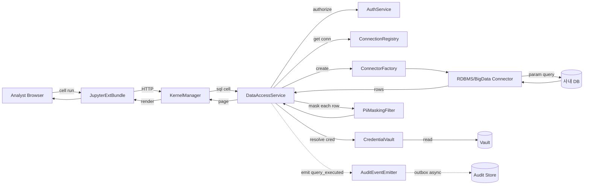
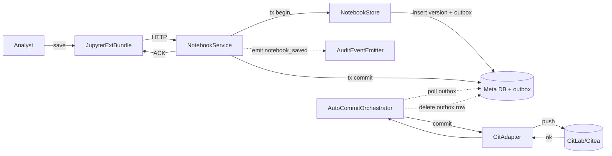
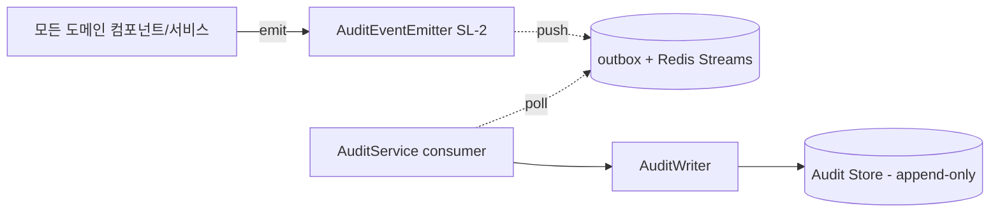

# Component Dependency — 내부망 데이터 분석 플랫폼

**작성일**: 2026-05-21
**통신 패턴 기본값**: 동기 (Q-AD-8=A) — in-process 함수 호출 또는 HTTP/JSON
**비동기 큐**: Redis Streams 또는 RabbitMQ (Q-AD-9=A) — outbox·감사·LLM·Git push에 한정
**의존 방향 원칙**: acyclic, 상위 → 하위 단방향 (런타임 비동기는 별도 표기)

---

## 1. 의존성 매트릭스 (Caller → Callee)

> **표기**: 🟢 = 동기 호출 / 🟠 = 비동기 (이벤트/큐) / · = 의존 없음
> 공유 라이브러리(SL-1~4)는 *모든 도메인 컴포넌트가 import* 하므로 매트릭스에서 생략.

### 1.1 Gateway / Auth Domain

| Caller \ Callee | OidcCB | KeycloakAdp | SessionStore | RoleResolver | AuthService |
|---|---|---|---|---|---|
| **ApiGateway** | 🟢 | · | 🟢 (validate) | · | 🟢 (verifyAccess) |
| **OidcCallbackHandler** | — | 🟢 | 🟢 | 🟢 | · |
| **AuthService** | · | 🟢 | 🟢 | 🟢 | — |
| **AuthServiceOrchestrator** (svc) | 🟢 | 🟢 | 🟢 | 🟢 | 🟢 |
| **AdminService** (svc) | · | · | · | 🟢 | 🟢 |

### 1.2 Connector + PII Domain

| Caller \ Callee | ConnReg | ConnFactory | RDBMS Conn | BigData Conn | QueryExec | SchemaIntr | PiiPolicy | PiiFilter | CredentialVault | VaultAdp |
|---|---|---|---|---|---|---|---|---|---|---|
| **QueryExecutor** | 🟢 | 🟢 | (via factory) | (via factory) | — | · | · | 🟢 | 🟢 | · |
| **SchemaIntrospector** | 🟢 | 🟢 | (via factory) | (via factory) | · | — | · | · | 🟢 | · |
| **CredentialVault** | · | · | · | · | · | · | · | · | — | 🟢 |
| **PiiMaskingFilter** | · | · | · | · | · | · | 🟢 (cache) | — | · | · |
| **DataAccessService** (svc) | 🟢 | 🟢 | (via factory) | (via factory) | 🟢 | · | · | 🟢 | 🟢 | · |
| **AdminService** (svc) | 🟢 | · | · | · | · | · | 🟢 | · | 🟢 | · |

### 1.3 Notebook + Visualization + Share + Git Domain

| Caller \ Callee | NotebookStore | JupyterHubSp | KernelMgr | FileUpload | ChartBuilder | ShareLink | GitAdp | AutoCommit |
|---|---|---|---|---|---|---|---|---|
| **JupyterExtBundle** (UI) | 🟢 | · | 🟢 | 🟢 | 🟢 | 🟢 | · | · |
| **KernelManager** | · | 🟢 | — | · | · | · | · | · |
| **NotebookService** (svc) | 🟢 | · | 🟢 | · | · | 🟢 | · | · |
| **NotebookStore** | — | · | · | · | · | · | · | 🟠 (outbox emit) |
| **AutoCommitOrchestrator** | · | · | · | · | · | · | 🟢 | — |

> `NotebookStore` → `AutoCommitOrchestrator`는 **outbox 큐 경유**의 비동기(🟠). 직접 참조 아님.

### 1.4 Audit + Ops + UI

| Caller \ Callee | AuditWriter | AuditQueryApi | BackupSch | RestoreVerf | AdminConsole | AuditorConsole |
|---|---|---|---|---|---|---|
| **AuditService** (svc) | 🟢 (consumer) | 🟢 | · | · | · | · |
| **AuditEventEmitter** (SL-2) | 🟠 (outbox) | · | · | · | · | · |
| **AuditorConsole** (UI) | · | 🟢 (via AuditService) | · | · | · | — |
| **AdminConsole** (UI) | · | · | · | · | — | · |
| **BackupService** (svc) | · | · | 🟢 | 🟢 | · | · |

### 1.5 모든 도메인 → 공유 라이브러리

```text
모든 도메인 컴포넌트 → SecurityKernel        (진입 직후 호출, 의무)
모든 도메인 컴포넌트 → AuditEventEmitter    (도메인 이벤트 발행)
모든 도메인 컴포넌트 → Telemetry            (메트릭/로깅/트레이스)
모든 도메인 컴포넌트 → ResultTypes          (반환 타입)
```

---

## 2. 비동기(🟠) 경로 정리

비동기는 일관성보다 **신뢰성·디커플링** 우선 — outbox 패턴(Q-AD-14=A) 적용.

| # | Producer | Channel | Consumer | 페일오버 |
|---|---|---|---|---|
| **A1** | 모든 도메인 컴포넌트 (via AuditEventEmitter) | outbox 테이블 + Redis Streams | AuditWriter (via AuditService consumer) | 큐 다운 시 outbox 보존, AuditWriter 다운 시 fail-closed 또는 큐 재시도 |
| **A2** | NotebookStore (저장 시) | outbox 테이블 | AutoCommitOrchestrator | Git 서버 다운 시 3회 재시도 → outbox 유지 |
| **A3** | QueryExecutor (5s 임계 초과) | 백그라운드 잡 큐(Redis Streams) | KernelManager (job runner) | 잡 누적 한도 시 큐잉 + 알림 |
| **A4** (Phase 2) | LlmProxyAdapter | 외부 API 큐 | LlmGovernor | 화이트리스트 외 도메인 자동 차단 |

---

## 3. 외부 시스템 결합 (Anti-Corruption Layer)

Q-AD-10=A: **모든 외부 시스템마다 어댑터 컴포넌트**. 도메인은 어댑터에만 의존.

| 외부 시스템 | 어댑터 컴포넌트 | 사용 컴포넌트 |
|---|---|---|
| Keycloak | `KeycloakAdapter` | AuthService, OidcCallbackHandler, AuthServiceOrchestrator |
| Vault (또는 동등) | `VaultAdapter` | CredentialVault |
| 사내 RDBMS | `RdbmsConnector` | QueryExecutor (via ConnectorFactory), SchemaIntrospector |
| 사내 Big-Data SQL | `BigDataSqlConnector` | QueryExecutor (via ConnectorFactory), SchemaIntrospector |
| JupyterHub | `JupyterHubSpawner` | KernelManager |
| GitLab/Gitea | `GitAdapter` | AutoCommitOrchestrator |
| (Phase 2) LLM API | `LlmProxyAdapter` | LlmGovernor |
| NAS/MinIO | (얇은 어댑터, FileUploadHandler 내부) | FileUploadHandler |

> 어댑터 외에 도메인 컴포넌트는 외부 SDK를 직접 import 하지 않음. 테스트 시 어댑터를 fake로 치환.

---

## 4. 데이터 흐름 다이어그램 (대표 시나리오)

### 4.1 SQL 실행 흐름 (US-NB-02)



### 4.2 노트북 저장 + Git 커밋 흐름 (US-SHARE-01, Q-AD-14=A)



### 4.3 감사 발행 → 저장 (모든 이벤트)



---

## 5. 동기/비동기 선택 기준 (요약)

| 선택 | 적용 흐름 |
|---|---|
| **동기 (Q-AD-8=A 기본)** | 사용자 요청-응답 경로(SQL/노트북 저장의 메타 단계/권한 검사/스키마 트리) — 빠른 피드백 필요 |
| **비동기 (outbox/큐)** | Git push, 감사 영구 저장, 백그라운드 잡, (Phase 2) LLM 호출 — 외부 시스템 불안정성 격리 |

규칙: **외부 시스템 호출은 가능한 비동기 또는 timeout + 재시도 정책**으로 흐름을 보호.

---

## 6. Acyclic 검증

다음 그래프가 acyclic임을 확인:
- `ApiGateway → OidcCallback → KeycloakAdapter` (단방향)
- `AuthServiceOrchestrator → AuthService → {SessionStore, RoleResolver, KeycloakAdapter}` (단방향)
- `DataAccessService → {AuthService, ConnectionRegistry, CredentialVault → VaultAdapter, ConnectorFactory → Connector, PiiMaskingFilter → PiiPolicyStore}` (단방향)
- `NotebookService → {NotebookStore, ShareLinkManager, KernelManager → JupyterHubSpawner, DataAccessService}` (단방향)
- `NotebookStore --outbox--> AutoCommitOrchestrator → GitAdapter` (시간 비동기 — 런타임 결합 없음)
- `*.AuditEventEmitter --outbox--> AuditWriter` (시간 비동기)

**순환 없음.** Cross-cutting(SL-1~4) 호출은 hierarchy 외부의 utility이므로 의존 그래프에서 제외.

---

## 7. 통신 프로토콜 가정 (확정은 NFR Design)

| 호출 위치 | 가정 |
|---|---|
| Modular Monolith 내부 | in-process 함수 호출 (가장 빠름) |
| AdminConsole/AuditorConsole ↔ 백엔드 | HTTPS JSON (REST), Bearer token |
| JupyterExtBundle ↔ 백엔드 | HTTPS JSON, JupyterHub authenticator로 토큰 발급 |
| 백엔드 ↔ Keycloak/Vault/GitLab | HTTPS, mTLS 옵션 (Infrastructure Design) |
| 백엔드 ↔ 사내 DB | JDBC/ODBC + TLS |
| 백엔드 ↔ Redis Streams | TCP + AUTH |

> 도입 단계에서 모놀리스(in-process) 호출이 대부분. Phase 2에서 컴포넌트를 별도 서비스로 추출할 때 HTTP/gRPC로 승격.

---

## 8. 보안 경계 (Defense in Depth, Q-AD-13=A)

호출은 다음 단계마다 인가 가능:
1. **ApiGateway**: TLS 종단 + Rate Limiting + 기본 헤더
2. **SecurityKernel.authenticate**: 토큰 검증 (모든 진입점)
3. **SecurityKernel.authorize**: 액션 단위 인가 (모든 진입점)
4. **도메인 검증**: 컴포넌트 자체의 정책 (예: ConnectionRegistry.list가 RBAC 필터)
5. **fail-closed 예외 처리**: 어떤 단계에서든 에러 시 일반화 메시지(SECURITY-15)

단일 실패점이 발생하지 않도록 **최소 2개 단계의 인가**를 항상 통과시킴.
