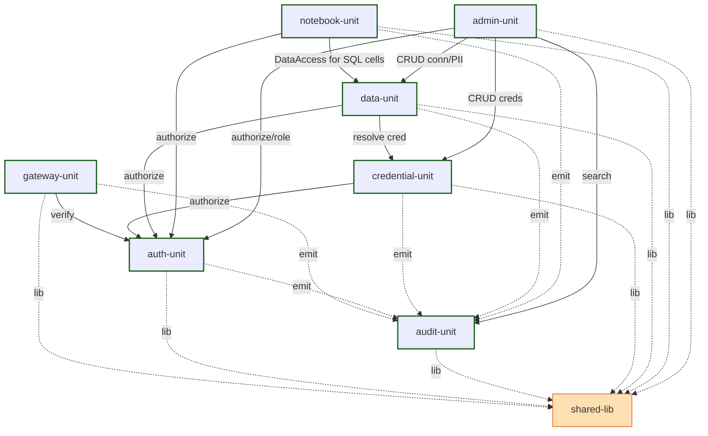

# Unit of Work — Dependency Matrix

**작성일**: 2026-05-21
**기반**: `unit-of-work.md`, `component-dependency.md`

> **표기**: 🟢 = 동기 호출 / 🟠 = 비동기 (outbox/queue) / — = 자기 자신 / · = 의존 없음

---

## 1. 유닛 의존성 매트릭스 (Caller → Callee, MVP)

| Caller \ Callee | gateway | auth | audit | credential | data | notebook | admin | shared-lib |
|---|---|---|---|---|---|---|---|---|
| **gateway** | — | 🟢 (verify) | 🟠 (emit) | · | · | · | · | 🟢 (lib) |
| **auth** | · | — | 🟠 (emit) | · | · | · | · | 🟢 |
| **audit** | · | 🟢 (authorize Auditor) | — | · | · | · | · | 🟢 |
| **credential** | · | 🟢 (authorize) | 🟠 (emit) | — | · | · | · | 🟢 |
| **data** | · | 🟢 (authorize) | 🟠 (emit) | 🟢 (resolve cred) | — | · | · | 🟢 |
| **notebook** | · | 🟢 (authorize) | 🟠 (emit) | · | 🟢 (DataAccess for SQL cells) | — | · | 🟢 |
| **admin** | · | 🟢 (authorize, role mgmt) | 🟢 (search/export) | 🟢 (CRUD creds) | 🟢 (CRUD connections, PII patterns) | · | — | 🟢 |
| **shared-lib** | · | · | · | · | · | · | · | — |
| **phase2-incubation** | · | 🟢 | 🟠 | 🟢 | 🟢 | 🟢 | · | 🟢 |

### 화살표 읽기
- 모든 도메인 유닛 → **shared-lib** (의무 의존, 라이브러리 import)
- 모든 도메인 유닛 → **audit-unit** (비동기 outbox로 이벤트 발행)
- 모든 도메인 유닛 → **auth-unit** (요청 진입 시 인가)
- **gateway-unit**은 라우터 — 외부에서만 호출, 내부 유닛 거의 호출 안 함 (요청 forwarding은 별개)

---

## 2. 의존 방향 그래프 (Mermaid)



---

## 3. Acyclic 검증

화살표 따라 순환 없음:
- `gateway → auth` (단방향)
- `credential → auth` (단방향)
- `data → {auth, credential}` (단방향)
- `notebook → {auth, data}` (단방향)
- `admin → {auth, credential, data, audit}` (단방향)
- `audit → auth` (Auditor 인가 시) — auth는 audit으로의 호출은 비동기 outbox 뿐. 동기 그래프에서는 단방향
- 모든 유닛 → `shared-lib` (libra, 단방향)

비동기 outbox(`*  ⇢  audit`)는 시간 비동기이므로 acyclic 분석에서 별도 평면 — 런타임 결합 없음.

**결론**: ✅ acyclic

---

## 4. 통신 패턴 요약

### 4.1 동기 호출 (in-process, Modular Monolith)
- 같은 컨테이너(backend) 안에 있는 유닛들끼리는 함수 호출. 빠르고 트랜잭션 공유 가능.

### 4.2 동기 호출 (HTTP, cross-container)
- `gateway-unit` ↔ backend (HTTP)
- `admin-unit`의 SPA → backend (HTTPS JSON)
- JupyterExtensionsBundle (분석가 브라우저) → backend (HTTPS JSON)
- backend ↔ Keycloak/Vault/GitLab (HTTPS, 외부 어댑터)

### 4.3 비동기 (outbox, Redis Streams / outbox 테이블)
- 모든 도메인 유닛 → `audit-unit` (감사 outbox)
- `notebook-unit` 내부 — `NotebookStore` → `AutoCommitOrchestrator`
- `data-unit` 내부 — `QueryExecutor` → 백그라운드 잡 큐 (5초 임계)
- (Phase 2) 도메인 유닛 → `llm-proxy` (LLM 호출 큐)

---

## 5. 빌드 순서 (병렬화 안내)

### 5.1 의존 그래프 기반 빌드 시퀀스

```text
Stage 1 (병렬 가능, 의존 없음 — 라이브러리 먼저):
   - shared-lib

Stage 2 (Stage 1 완료 후, 병렬):
   - gateway-unit
   - auth-unit
   - audit-unit
   - credential-unit

Stage 3 (auth + credential 완료 후, 병렬):
   - data-unit

Stage 4 (auth + data 완료 후, 병렬):
   - notebook-unit

Stage 5 (모든 유닛 완료 후):
   - admin-unit (다른 유닛의 API 표면을 호출하므로)

Stage 6 (전체 통합):
   - infra/ (Docker Compose)
   - integration tests
```

### 5.2 병렬화 기회
- Stage 2의 4 유닛은 완전 병렬 가능
- Stage 3·4·5는 각각 1 유닛이지만 내부 모듈 단위로 병렬 작업 가능
- 일정 단축 효과: 7주 → 5~6주 추정

---

## 6. 시간 비동기 경로 정리

| # | 발행 유닛 | 채널 | 소비 유닛 | 일관성 모델 |
|---|---|---|---|---|
| A1 | 모든 유닛 (via AuditEventEmitter) | outbox table + Redis Streams | audit-unit | eventual consistency (≤ 5초) |
| A2 | notebook-unit (NotebookStore 저장) | outbox table | notebook-unit 내부 AutoCommitOrchestrator → GitAdapter | eventual (재시도 3회) |
| A3 | data-unit (QueryExecutor 5s+) | Redis Streams (job queue) | data-unit 내부 job runner | eventual (잡 완료 시 알림) |
| A4 | phase2-incubation (LLM) | Redis Streams | llm-proxy → 외부 API | eventual (백그라운드 응답) |

---

## 7. 외부 시스템 의존 (유닛별)

| 외부 시스템 | 유닛 | 결합 강도 |
|---|---|---|
| Keycloak | auth-unit (어댑터), gateway-unit (위탁) | 강 (인증 핵심) |
| Vault | credential-unit | 강 |
| GitLab/Gitea | notebook-unit (어댑터) | 약 (Git 다운 시 outbox 보존) |
| 사내 RDBMS | data-unit | 강 (커넥션 마다 다름) |
| 사내 빅데이터 (Hive/Impala/Presto/Trino) | data-unit | 강 |
| NAS / MinIO | data-unit (FileUploadHandler) | 중 |
| JupyterHub | notebook-unit | 강 (코어 UX) |
| 메타 DB | 거의 모든 유닛 | 강 |
| Redis (Streams + 세션) | 거의 모든 유닛 | 중 |
| Prometheus + Grafana | shared-lib (Telemetry exporter) | 약 (관측 부재 시 알림만 손실) |
| 사내 백업 스토리지 | admin-unit (BackupScheduler) | 중 |
| (Phase 2) 상용 LLM API | phase2-incubation (LlmProxy) | 약 (Phase 2부터) |

---

## 8. Phase 2 시 의존성 변화 예측

- 새 유닛 등장: `llm-proxy`, `reporting`, `dw-connector`
- `llm-proxy` ← `notebook-unit` (Text-to-SQL 등에서 호출)
- `reporting` ← `notebook-unit` (보고서 생성)
- `dw-connector` ← `data-unit` (외부 DW 추가)
- K8s 마이그레이션 시 컨테이너 B 안의 유닛들이 분리 — HTTP/gRPC 표면 노출 필요 (NFR Design 단계)
