# Execution Plan — 내부망 데이터 분석 플랫폼

**작성일**: 2026-05-21
**프로젝트 유형**: Greenfield
**기반 입력**: `requirements.md`, `personas.md`, `stories.md`

---

## 1. 상세 분석 요약 (Detailed Analysis Summary)

### 1.1 Transformation Scope
- **N/A** — Greenfield 신규 구축이므로 기존 시스템 변환 범위는 없음.
- 사내 인프라(컨테이너 레지스트리, Git, IdP 등)는 가정/제약(`requirements.md §4`)으로 처리.

### 1.2 Change Impact Assessment

| 영역 | 영향 | 설명 |
|---|---|---|
| **User-facing changes** | ✅ Yes | 전체 신규 UX (JupyterLab 기반). 4개 페르소나 모두 1차 사용자 |
| **Structural changes** | ✅ Yes | 신규 마이크로컴포넌트 다수 (Auth Proxy, Connector Service, Notebook Spawner, Visualization, Audit Sink, Vault, LLM Proxy 등) |
| **Data model changes** | ✅ Yes | 신규 엔티티 다수: User, Role, Connection, Credential(암호화), Workspace, Notebook, AuditLog, PIIPolicy, ShareLink 등 |
| **API changes** | ✅ Yes | 전체 신규 API 표면 (REST/JSON + JupyterHub API 확장) |
| **NFR impact** | ✅ Yes | 15 SECURITY + 10 PBT + 성능/가용성/관측성 모두 신규 |

### 1.3 Component Relationships
- **N/A** (Greenfield) — Application Design 단계에서 컴포넌트 그래프 신규 정의 예정.

### 1.4 Risk Assessment

| 항목 | 평가 |
|---|---|
| **Risk Level** | **High** |
| **Rollback Complexity** | Moderate — Docker Compose 기반 MVP는 컨테이너 단위 롤백 가능. 다만 데이터(워크스페이스/감사로그) 보존 정책이 롤백 시나리오를 복잡하게 함 |
| **Testing Complexity** | Complex — PBT 10규칙 + 보안 베이스라인 15규칙 + 통합 + 성능(50명 동시) |

**High 판정 근거**:
1. 보안 베이스라인 15개 규칙이 모두 blocking → 단 하나라도 미충족 시 단계 완료 불가
2. 폐쇄망 + 화이트리스트 외부망 제약 → 의존성 해결과 패키지 미러 구축에 추가 변수
3. 다중 통합 포인트(Keycloak, Vault, JupyterHub, GitLab/Gitea, Prometheus/Grafana, LLM 프록시) — 하나라도 사내 인프라 가정과 어긋나면 일정 영향
4. MVP 1~2개월 일정 (Q27=A) — 범위 + 보안 + PBT 부담 대비 빠른 일정

**완화책**:
- Phase 분리 (LLM, 외부 DW, 보고서 → Phase 2) — `requirements.md §5`
- 동시 활성 50명 + 단일 쿼리/파일 한도(NFR-PERF-03~05) 로 부하 시나리오 단순화
- PBT 적용 스토리 13개로 우선 한정(`stories.md G7`) — MVP에서는 핵심만 자동화

---

## 2. Workflow Visualization

```mermaid
flowchart TD
    Start(["User Request"])

    subgraph INCEPTION["🔵 INCEPTION PHASE"]
        WD["Workspace Detection<br/><b>COMPLETED</b>"]
        RE["Reverse Engineering<br/><b>SKIPPED (Greenfield)</b>"]
        RA["Requirements Analysis<br/><b>COMPLETED</b>"]
        US["User Stories<br/><b>COMPLETED</b>"]
        WP["Workflow Planning<br/><b>IN PROGRESS</b>"]
        AD["Application Design<br/><b>EXECUTE</b>"]
        UG["Units Generation<br/><b>EXECUTE</b>"]
    end

    subgraph CONSTRUCTION["🟢 CONSTRUCTION PHASE (per-unit loop)"]
        FD["Functional Design<br/><b>EXECUTE</b>"]
        NFRA["NFR Requirements<br/><b>EXECUTE</b>"]
        NFRD["NFR Design<br/><b>EXECUTE</b>"]
        ID["Infrastructure Design<br/><b>EXECUTE</b>"]
        CG["Code Generation<br/>(Planning + Generation)<br/><b>EXECUTE</b>"]
        BT["Build and Test<br/><b>EXECUTE</b>"]
    end

    subgraph OPERATIONS["🟡 OPERATIONS PHASE"]
        OPS["Operations<br/><b>PLACEHOLDER</b>"]
    end

    Start --> WD
    WD --> RE
    RE --> RA
    RA --> US
    US --> WP
    WP --> AD
    AD --> UG
    UG --> FD
    FD --> NFRA
    NFRA --> NFRD
    NFRD --> ID
    ID --> CG
    CG --> BT
    BT --> OPS
    OPS --> End(["Complete"])

    style WD fill:#4CAF50,stroke:#1B5E20,stroke-width:3px,color:#fff
    style RA fill:#4CAF50,stroke:#1B5E20,stroke-width:3px,color:#fff
    style US fill:#4CAF50,stroke:#1B5E20,stroke-width:3px,color:#fff
    style WP fill:#FFA726,stroke:#E65100,stroke-width:3px,color:#000
    style AD fill:#FFA726,stroke:#E65100,stroke-width:3px,stroke-dasharray: 5 5,color:#000
    style UG fill:#FFA726,stroke:#E65100,stroke-width:3px,stroke-dasharray: 5 5,color:#000
    style FD fill:#FFA726,stroke:#E65100,stroke-width:3px,stroke-dasharray: 5 5,color:#000
    style NFRA fill:#FFA726,stroke:#E65100,stroke-width:3px,stroke-dasharray: 5 5,color:#000
    style NFRD fill:#FFA726,stroke:#E65100,stroke-width:3px,stroke-dasharray: 5 5,color:#000
    style ID fill:#FFA726,stroke:#E65100,stroke-width:3px,stroke-dasharray: 5 5,color:#000
    style CG fill:#4CAF50,stroke:#1B5E20,stroke-width:3px,color:#fff
    style BT fill:#4CAF50,stroke:#1B5E20,stroke-width:3px,color:#fff
    style RE fill:#BDBDBD,stroke:#424242,stroke-width:2px,stroke-dasharray: 5 5,color:#000
    style OPS fill:#FFF59D,stroke:#827717,stroke-width:2px,color:#000
    style Start fill:#CE93D8,stroke:#6A1B9A,stroke-width:3px,color:#000
    style End fill:#CE93D8,stroke:#6A1B9A,stroke-width:3px,color:#000

    linkStyle default stroke:#333,stroke-width:2px
```

---

## 3. Phases to Execute

### 🔵 INCEPTION PHASE

- [x] **Workspace Detection** — COMPLETED (2026-05-21)
- [x] **Reverse Engineering** — SKIPPED
  - *Rationale*: Greenfield 프로젝트, 기존 코드 없음
- [x] **Requirements Analysis** — COMPLETED (2026-05-21, Comprehensive)
- [x] **User Stories** — COMPLETED (40 MVP + 12 Phase 2/3 outlines)
- [x] **Workflow Planning** — IN PROGRESS (본 문서)
- [ ] **Application Design** — **EXECUTE**
  - *Rationale*: 신규 컴포넌트 다수(Auth Proxy, Connector Service, Notebook Spawner, Visualization, Audit Sink, Vault, Admin Console, [Phase 2] LLM Proxy 등). 서비스 레이어 설계 + 컴포넌트 의존성 + 비즈니스 룰(예: PII 마스킹, 자격증명 회전, Git 자동 커밋 흐름) 정의 필요.
- [ ] **Units Generation** — **EXECUTE**
  - *Rationale*: 시스템을 다중 유닛(예: `auth-svc`, `connector-svc`, `notebook-runtime`, `audit-svc`, `admin-ui`, `web-gateway` 등)으로 분해 필요. 폐쇄망 컨테이너 단위 배포·테스트의 기본 단위이기도 함. 사용자가 답변한 Q27=A(1~2개월 MVP) 일정을 맞추려면 명시적 단위 분할로 병렬 작업이 필수.

### 🟢 CONSTRUCTION PHASE (각 유닛마다 루프)

- [ ] **Functional Design** — **EXECUTE** (per-unit)
  - *Rationale*: 신규 데이터 모델 다수(User, Role, Connection, Credential, Workspace, Notebook, AuditLog, PIIPolicy, ShareLink). 복잡한 비즈니스 룰(자격증명 회전, Git 자동 커밋, 권한 결합, 마스킹 룰 확장).
- [ ] **NFR Requirements** — **EXECUTE** (per-unit)
  - *Rationale*: 15 SECURITY 규칙 + 10 PBT 규칙 + 성능 한도(50명, 1GB 업로드, 5초 쿼리 임계) 모두 유닛별 매핑 필요. 기술 스택 선택(예: 백엔드 언어/프레임워크) 결정.
- [ ] **NFR Design** — **EXECUTE** (per-unit)
  - *Rationale*: NFR Requirements 실행 결과를 설계 패턴에 반영(예: Rate Limiting, Circuit Breaker, 감사 로그 큐잉, fail-closed 예외 처리).
- [ ] **Infrastructure Design** — **EXECUTE** (per-unit)
  - *Rationale*: 폐쇄망 + 화이트리스트 외부망 + Docker Compose MVP + K8s 마이그레이션 경로(NFR-DEPLOY-02). 컨테이너 레지스트리/PyPI 미러/IaC 도구(Ansible|Terraform) 매핑 필요.
- [ ] **Code Generation** — **EXECUTE** (per-unit, ALWAYS)
  - *Rationale*: 실제 구현. PBT 10규칙은 코드 생성 단계에서 동시 작성. 보안 베이스라인 15규칙도 단계마다 검증.
- [ ] **Build and Test** — **EXECUTE** (ALWAYS, 전체 유닛 완료 후)
  - *Rationale*: 빌드 + 단위 + 통합 + 성능 + 보안 + PBT 통합 검증. SBOM/취약점 스캐너(SECURITY-10) 강제.

### 🟡 OPERATIONS PHASE

- [ ] **Operations** — PLACEHOLDER
  - *Rationale*: 본 워크플로 정의상 향후 확장 영역. MVP 1~2개월 일정에는 미포함.

---

## 4. 스킵된 단계 (Skipped Stages)

- **Reverse Engineering** — Greenfield (코드 없음)
- **Operations 상세 활동** — 본 워크플로 placeholder (배포·운영 절차는 Build/Test 단계의 `build-and-test/` 산출물로 시작)

> 별도로 모든 Construction 조건부 단계(Functional/NFR/Infra Design)는 **모두 EXECUTE** 결정. MVP라도 보안 베이스라인 강제 때문에 NFR 단계 생략 불가.

---

## 5. Package/Unit Change Sequence (Greenfield)

> Greenfield라 정식 "기존 패키지 업데이트 시퀀스"는 없으나, **신규 단위 구축 권장 순서**를 미리 정리. (정식 단위는 Units Generation 단계에서 확정.)

| 순서 | 신규 유닛(예시) | 사유 |
|---|---|---|
| 1 | **`web-gateway`** + **`auth-svc`** | 모든 후속 유닛이 인증·라우팅에 의존. Keycloak 연동 우선. |
| 2 | **`audit-svc`** + **`vault-integration`** | 모든 이벤트가 감사·자격증명에 의존. SECURITY-14 fail-closed 보장. |
| 3 | **`connector-svc`** + **`pii-masking`** | 데이터 액세스 + PII 정책. 분석 흐름의 기초. |
| 4 | **`notebook-runtime`** (JupyterHub 확장) | 1·2·3에 의존. Analyst의 핵심 워크스페이스. |
| 5 | **`visualization`** + **`share-svc`** + **`git-integration`** | 노트북에 부착되는 부가 가치. 병렬 진행 가능. |
| 6 | **`admin-ui`** + **`audit-ui`** | 관리자/감사 콘솔. 위 5단계 완료 후 가능. |
| 7 | **(Phase 2) `llm-proxy`, `reporting-svc`, `dw-connector`** | 일정·보안 검토 후. |

**병렬화 가능 구간**: 5번 그룹은 1~4 완료 후 3개 유닛 병렬 가능. 6번도 5와 일부 병렬.

---

## 6. Estimated Timeline

| 단계 | 기간 (참고) |
|---|---|
| Application Design | 3~5일 |
| Units Generation | 2~3일 |
| Per-unit Loop (5~7 유닛 × FD/NFR-R/NFR-D/Infra/Code) | 4~6주 |
| Build & Test (전체) | 1~2주 |
| **총 MVP 도달까지** | **6~8주** (≈ 1.5~2개월) — Q27=A 일치 |
| Phase 2 (LLM, Reporting, K8s 등) | MVP 이후 +3개월 |
| Phase 3 (PPT/Word, HA) | TBD |

---

## 7. Success Criteria

### 7.1 Primary Goal
부서 단위(10~50명) 분석가가 외부 도구 없이 사내망에서 SQL+시각화+노트북 공유를 1.5~2개월 안에 완료할 수 있는 플랫폼 출시 (MVP).

### 7.2 Key Deliverables
- 인증·커넥션·노트북·시각화·공유·감사 6개 핵심 도메인의 동작 가능한 MVP
- 보안 베이스라인 15규칙 모두 통과
- PBT 10규칙 모두 적용된 핵심 비즈니스 로직 (적용 가능 13개 스토리)
- Docker Compose 기반 배포 + IaC + 폐쇄망 친화 의존성
- 운영 대시보드(Prometheus/Grafana) + 감사 로그(append-only, 1년 보존)

### 7.3 Quality Gates
- **G1 (Application Design 종료)**: 모든 컴포넌트가 단일 책임 원칙 + 의존 방향 충돌 없음
- **G2 (Units Generation 종료)**: 5~7개 유닛으로 분해, 의존성 그래프 acyclic
- **G3 (각 유닛 Code Generation 종료)**: 단위 테스트 + PBT 적용 가능 항목 통과, 보안 베이스라인 단위별 점검
- **G4 (Build/Test 종료)**: 통합 테스트 통과, 성능(50명 동시) 검증, SBOM + 취약점 스캐너 0 critical/high, 백업 리허설 1회 성공

---

## 8. 부록 — Adaptive Detail Note

- Application Design / Functional Design / NFR Design: **standard~comprehensive** 깊이 (High Risk 반영)
- Infrastructure Design: **comprehensive** (폐쇄망 제약이 까다로움)
- Code Generation: **standard** (이미 깊이 있는 설계 산출물이 선행)
- Build & Test: **comprehensive** (15+10 규칙 검증)

---

## 9. 참조

- 요구사항: `aidlc-docs/inception/requirements/requirements.md`
- 사용자 스토리: `aidlc-docs/inception/user-stories/stories.md`
- 페르소나: `aidlc-docs/inception/user-stories/personas.md`
- 확장: `.aidlc-rule-details/extensions/security/baseline/security-baseline.md`, `.aidlc-rule-details/extensions/testing/property-based/property-based-testing.md`
